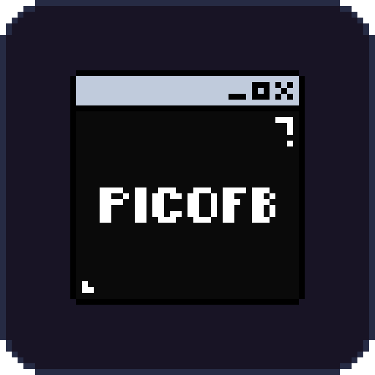

<div align="center">
    
    <h1>picofb.h</h1>
</div>

A minimal single-header framebuffer library for quickly getting pixels on screen with multi input handling

## Features

- Simple API: init, set pixels, update, cleanup
- Two implementations (API compatible with both):
  - **X11**: Faster performance (~2x FPS), Linux/X11 only
  - **SDL2**: Cross-platform (Linux/Windows/Mac)
- Save framebuffer to PPM image format
- Configurable resolution via compile-time defines

## Use cases
- Software rendered applications (UI, Games)
- Easy render testing

## Usage
See `example.c`

## Compilation

```bash
gcc example.c -o example -lSDL2
```
or define `PICOFB_X11_BACKEND` use X11 
```bash
gcc example.c -o example -lX11 
```