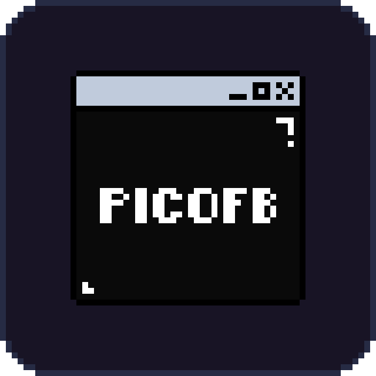

    
    <h1>picofb.h</h1>

A minimal single-header cross-platform windowing library for displaying a framebuffer on screen with multi-key and mouse handling

## Features
- Single header and simple API
- Multi-key and mouse input
- Many implementations (Auto backend select):
  - **LINUX**: Linux (X11 & Wayland) (with SHM)
  - **WIN32**: Windows
  - **SDL3**: Cross-platform, Slower, Fallback

## Use cases
- Software rendered applications (UI, Games)
- Prototyping and easy render testing
- Educational

## Usage
See `example.c` and docs section in `picofb.h`

## Compilation
Link with:

- Linux/X11: -lX11 -lXext
- Linux/Wayland: xdg-shell-client-protocol.c -DPICOFB_WAYLAND -lwayland-client
- Windows: -lgdi32 -luser32
- Others: -lSDL3

